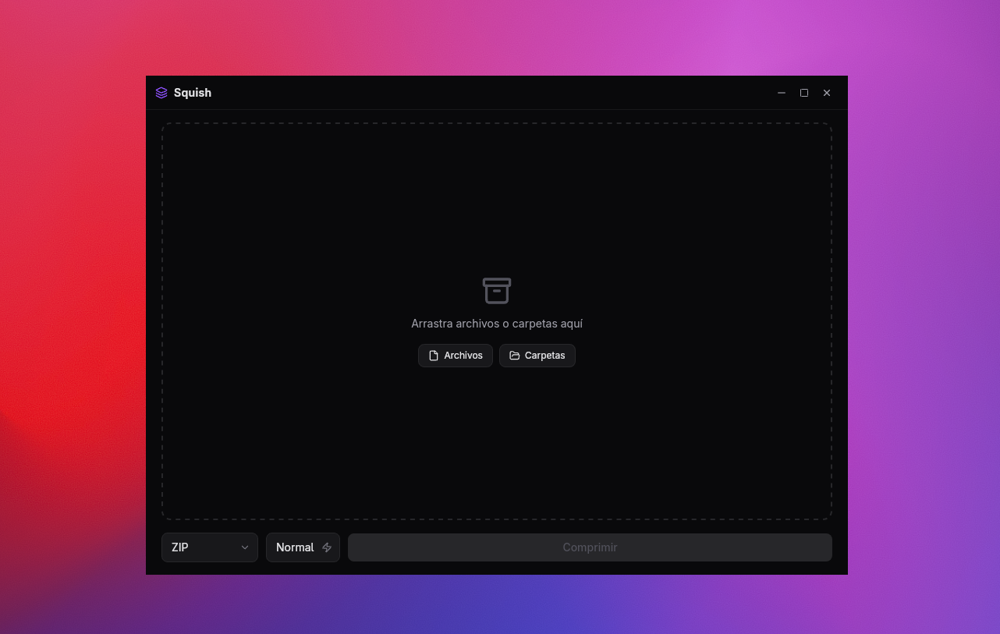

# Squish

Aplicacion de escritorio para comprimir archivos y carpetas de forma rapida y sencilla. Construida con **Tauri v2**, **React** y **Rust**.



## Caracteristicas

- **Drag and drop** -- Arrastra archivos y carpetas directamente a la ventana
- **Selector de archivos nativo** -- Botones para elegir archivos o carpetas desde el explorador del sistema
- **Multiples formatos de compresion:**
  - 7z (LZMA2)
  - ZIP (Deflate)
  - ZSTD (tar.zst)
- **Tres niveles de compresion:**
  - Rapida -- menor compresion, mayor velocidad
  - Normal -- equilibrada (por defecto)
  - Maxima -- mayor ratio de compresion
- **Progreso en tiempo real** -- Barra de progreso con contador de archivos
- **Resumen de resultados** -- Muestra tamano original, tamano comprimido y porcentaje de reduccion
- **Abrir carpeta de destino** -- Botone para abrir la carpeta donde se guardo el archivo comprimido
- **Manejo recursivo de directorios** -- Comprime todo el contenido interno de las carpetas
- **Interfaz moderna** -- Ventana sin bordes con controles personalizados y tema oscuro

## Stack tecnico

| Capa | Tecnologia |
|------|------------|
| Framework de escritorio | Tauri v2 |
| Backend | Rust |
| Frontend | React 19 + TypeScript |
| Build tool | Vite 7 |
| Estilos | Tailwind CSS v4 |
| Estado | Zustand |
| Iconos | Lucide React |

## Requisitos previos

- [Node.js](https://nodejs.org/) (con npm)
- [Rust](https://www.rust-lang.org/tools/install) (con cargo)
- [Tauri CLI v2](https://tauri.app/start/prerequisites/)

## Instalacion

1. Clonar el repositorio:

```bash
git clone https://github.com/tu-usuario/squish.git
cd squish
```

2. Instalar dependencias del frontend:

```bash
npm install
```

## Uso

### Modo desarrollo

```bash
npm run tauri dev
```

Esto inicia Vite con hot-reload en el puerto 1420 y abre la ventana de la aplicacion.

### Compilar para produccion

```bash
npm run tauri build
```

Genera el ejecutable optimizado para tu sistema operativo en `src-tauri/target/release/`.

## Como usar la aplicacion

1. Abre la aplicacion
2. Arrastra archivos o carpetas a la ventana, o usa los botones "Archivos" / "Carpetas"
3. Selecciona el formato de compresion (7z, ZIP o ZSTD)
4. Elige el nivel de compresion (Rapida, Normal o Maxima)
5. Haz clic en "Comprimir"
6. Espera a que termine el progreso
7. Revisa el resumen de resultados y abre la carpeta de destino

## Licencia

MIT
